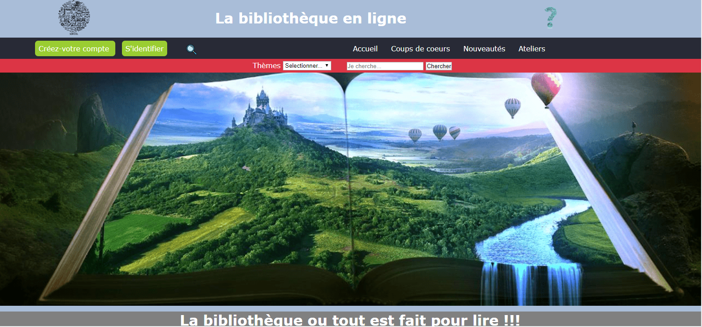

# la bibliothèque en ligne 

# Commencer
Ces instructions vous permettront d'obtenir une copie du projet sur votre ordinateur local à des fins de développement et de test. Voir déploiement pour des notes sur la façon de déployer le projet sur un système actif.

## note codeClimate

## Langage utilisé
* html5 
* css3
* javaScript
* php
* jquery

## Description du projet
Ce projet est une bibliothèque en ligne pour mon projet de fin d'année

# Exécution des tests
Expliquez ce que ces tests testent et pourquoi 

# Déploiement
Ajoutez des notes supplémentaires sur la façon de déployer cela sur un système en direct

# Auteurs
*Lemoine gwénola - Travail initial - la bibliothèque en ligne

# Remerciements
*inspiration 
